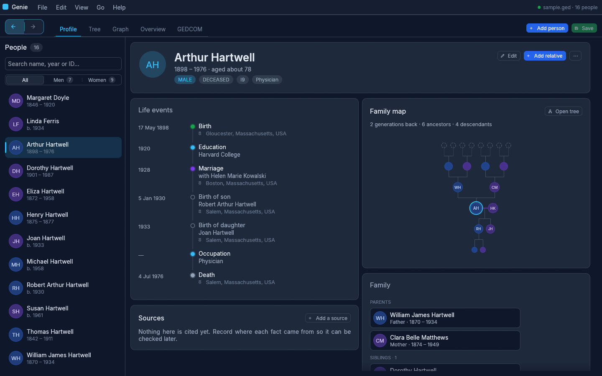
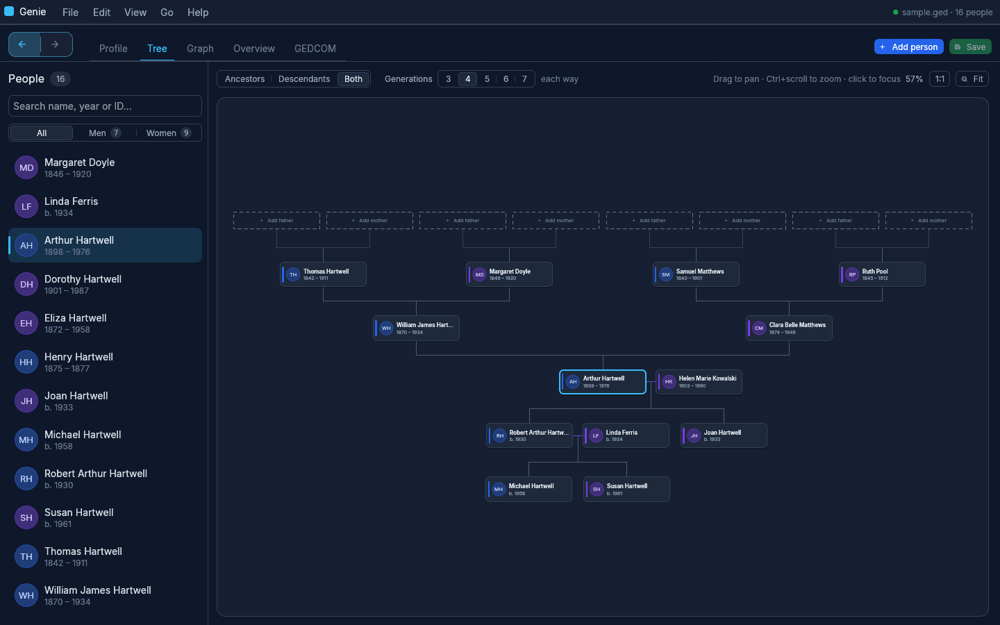
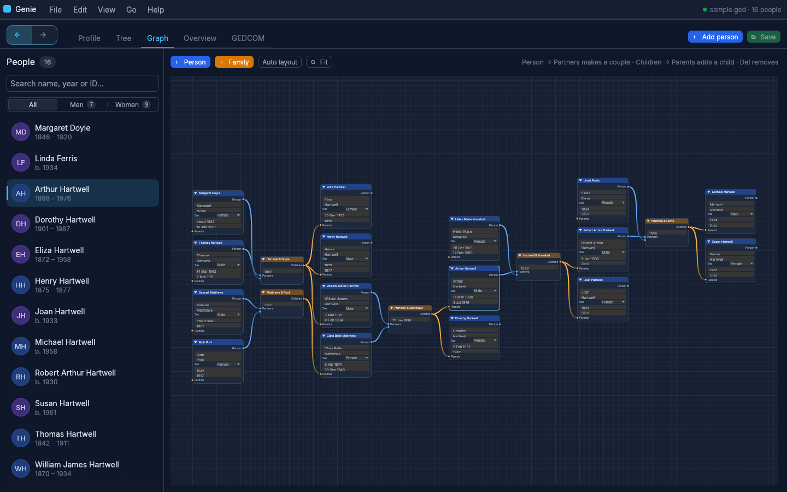

# Genie

A desktop app for viewing, building and editing family trees stored as GEDCOM files.







## Install on Windows

**[Download the latest Windows installer](https://github.com/ahenshaw/genie/releases/latest/download/Genie-windows-x64-setup.exe)**, or pick a version from the [Releases](https://github.com/ahenshaw/genie/releases) page (`Genie-<version>-windows-x64-setup.exe`), and run it. It installs for your user account without needing admin rights; tick *Open .ged files with Genie* if you want double-clicking a GEDCOM file to open it in Genie. Windows SmartScreen may warn that the installer is from an unknown publisher, as it isn't code-signed: choose *More info → Run anyway*.

## Requirements

- Rust 1.95 or newer ([rustup.rs](https://rustup.rs))
- On Linux, file dialogs use the XDG desktop portal (`xdg-desktop-portal`), which most desktops already have.

## Build and run

```sh
git clone https://github.com/ahenshaw/genie.git
cd genie
cargo run --release
```

To open a file directly:

```sh
cargo run --release -- path/to/family.ged
```

## Use it in a web browser

Genie can also run as a small local web server and show the same app in a browser tab. The browser version is built with [trunk](https://trunkrs.dev) and embedded in the Genie executable:

```sh
rustup target add wasm32-unknown-unknown
cargo install trunk
trunk build --release        # builds the browser app into dist/
cargo build --release        # embeds dist/ into Genie
./target/release/genie --serve path/to/family.ged
```

This opens `http://localhost:8080/` (use `--port N` to change it, `--no-browser` not to open one). Saving in the browser writes back to that `.ged` file, and photos and documents are fetched from the server. The server only listens on this computer (localhost) and has no login. The browser can't reach files on disk, so adding or relinking media files, *Find media files…* and *Get photos from WikiTree…* stay in the desktop app. Stop the server with Ctrl+C.

## Getting started

- **Open a file:** File → Open… (Ctrl+O), or drag a `.ged` file onto the window.
- **Try the sample:** click *Explore the sample* on the start screen, or File → Open sample tree.
- **Start a new tree:** File → New tree (Ctrl+N) and add the first person. Add parents, partners, children and siblings from the *Family* card on their profile, or from the dashed **+** slots in the Tree view.
- **Edit someone:** select them and press Ctrl+E, or click *Edit* on their profile.
- **See how two people are related:** right-click someone and choose *Relationship to …*, or open the Relationship section and pick both people.
- **Add documents and photos:** drop files onto the window to attach them to the selected person, or use *Add* on their profile. Files are copied into a `<tree name> media` folder next to the tree file. Save a new tree before adding documents.
- **Clean up an imported tree:** *Tools → Find duplicate people…* lists people who may have been entered twice and lets you compare and merge them; *Find duplicate sources…* merges repeated sources.
- **Get photos from WikiTree:** *Tools → Get photos from WikiTree…* asks for a WikiTree ID (for example `Henshaw-1012`), matches the WikiTree profiles around it to people in your tree, and lets you pick which photos to add. The photos are copied into the media folder and linked to each person.
- **Set a home person:** right-click someone and choose *Set as home person*. Each profile then shows how that person is related to them, and the way back to the home person is marked in amber: on the Family map, in the Tree view and on the next relative in the Family card.
- **Print-style reports:** open the Reports section and pick a report. It follows the selected person; click a name in a report (or a slice of the fan chart) to switch to them, and use *Copy as text* to paste a report elsewhere.
- **Move a tree to another computer:** *File → Export bundle…* writes the tree and all its documents into one `.gdz` file (the GEDZIP format from GEDCOM 7). Documents stored outside the tree's folder are included too, and any whose files can't be found are listed. On the other computer, open the `.gdz` with *File → Open…* (or drag it onto the window, or double-click it on Windows) and choose a folder: Genie unpacks it into a new folder there and opens the tree. In the browser, *File → Download bundle* downloads the saved tree the same way.
- **Save:** Ctrl+S, or Ctrl+Shift+S to save as a new file.

## Sections

| Section  | What it shows |
|----------|---------------|
| Profile  | The selected person's details, life events, sources, family, and a small family map |
| Tree     | Ancestors, descendants, or both around the selected person |
| Relationship | The line of descent connecting two people, and what the relationship is called |
| Media    | Every document and photo in the tree, with filters for unattached and missing files |
| Graph    | People and families as connected nodes that can be edited by wiring them together, either through family nodes or directly from parent to child |
| Reports  | Descendancy, Register and Ahnentafel reports, a family group sheet, and a fan chart of ancestors, for the selected person; names link to the people, and text reports can be copied |
| Overview | Counts, common surnames and places, and people missing key details |
| GEDCOM   | The selected person's records as they will be saved |

## Keyboard shortcuts

| Keys | Action |
|------|--------|
| Ctrl+N | New tree |
| Ctrl+O | Open |
| Ctrl+S / Ctrl+Shift+S | Save / Save as |
| Ctrl+Z / Ctrl+Shift+Z | Undo / Redo |
| Ctrl+F | Find a person |
| Ctrl+P | Add a person |
| Ctrl+E | Edit the selected person |
| Ctrl+Enter | Save in the editor |
| Alt+← / Alt+→ | Back / Forward |
| Alt+Home | Go to the home person |
| Ctrl+1 … Ctrl+8 | Switch section |

In the Tree view, drag to pan and Ctrl+scroll to zoom.

## Making a release

The *Windows installer* workflow (`.github/workflows/windows.yml`) builds the installer with [Inno Setup](https://jrsoftware.org/isinfo.php) from `installer/genie.iss`. To publish one:

1. Set the new version in `Cargo.toml` and commit it.
2. Tag the commit to match and push the tag:
   ```sh
   git tag v0.2.0
   git push origin v0.2.0
   ```

The workflow tests and builds Genie (including the browser app), then creates a GitHub release for the tag with the installer attached, which the download link above then points to. It fails if the tag doesn't match the version in `Cargo.toml`. Running the workflow by hand (*Actions → Windows installer → Run workflow*) builds the installer as a workflow artifact without making a release.

## Tests

```sh
cargo test
```
